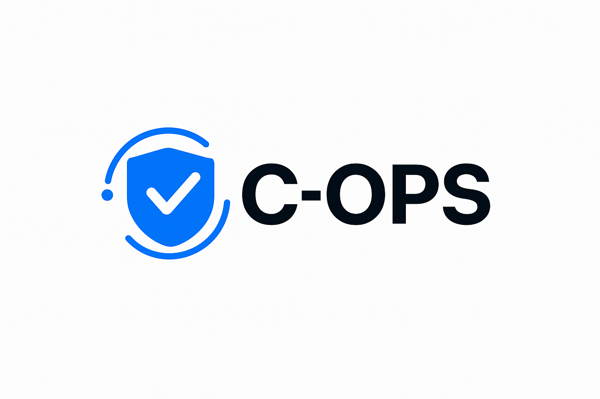

# <div align="center"><br>Cuti-Opeation System(C-OPS)</div>

<div align="center">


**Tugas Final Praktikum Pemrograman Web 2025**
*Digitalisasi Proses Pengajuan, Verifikasi, dan Manajemen Cuti Karyawan Berbasis Web*

</div>

---

## 📑 Daftar Isi
1. [Latar Belakang & Tujuan](#-latar-belakang--tujuan)
2. [Arsitektur & Teknologi](#-arsitektur--teknologi)
3. [Aktor & Hak Akses](#-aktor--hak-akses)
4. [Alur Logika Bisnis (Business Logic)](#-alur-logika-bisnis-business-logic)
5. [Fitur Detail & Validasi](#-fitur-detail--validasi)
6. [Struktur Database (ERD)](#-struktur-database-erd)
7. [Instalasi & Konfigurasi](#-instalasi--konfigurasi)
8. [Author](#-author)

---

## 📖 Latar Belakang & Tujuan
Sistem ini dikembangkan untuk menangani inefisiensi dalam pengajuan cuti manual. Sistem memfasilitasi 4 level pengguna (Admin, Karyawan, Ketua Divisi, HRD) dengan alur persetujuan berjenjang yang ketat dan otomatisasi perhitungan kuota.

**Solusi Utama:**
* **Otomatisasi Kuota:** Mengurangi kuota cuti tahunan secara otomatis hanya pada hari kerja (Senin-Jumat).
* **Hierarki Approval:** Memastikan setiap pengajuan diperiksa oleh atasan langsung sebelum ke HRD.
* **Audit Trail:** Merekam jejak persetujuan, penolakan, dan alasan pembatalan.

---

## 🛠 Arsitektur & Teknologi

### Teknologi Utama
* **Framework:** Laravel (Konsep MVC)
* **Database:** MySQL (Relational Data Model)
* **Frontend:** Blade Templates + Tailwind CSS (Responsive Design)
* **Autentikasi:** Laravel Auth dengan Middleware untuk pembatasan Role.

### Struktur Folder Penting
* `app/Http/Controllers`: Logika backend per modul (AuthController, LeaveController, DivisionController).
* `database/migrations`: Skema database terstruktur.
* `resources/views`: Antarmuka pengguna (UI).
* `routes/web.php`: Routing dengan pengelompokan Middleware (Prefix: admin, user, leader, hrd).

---

## 👥 Aktor & Hak Akses

Sistem menerapkan *Role-Based Access Control* (RBAC) yang ketat:

| Role | Tanggung Jawab Utama | Akses Data |
| :--- | :--- | :--- |
| **Admin** | Konfigurasi Sistem, User, & Divisi | Full Access (CRUD User & Divisi) |
| **User (Karyawan)** | Mengajukan cuti, Monitoring kuota | Data Pribadi, Form Pengajuan |
| **Ketua Divisi** | Verifikator tk. 1, Mengajukan cuti pribadi | Data Bawahan (Read/Approve), Data Pribadi |
| **HRD** | Final Approver, Reporting | All Leave Requests, Report Data |

---

## 🧠 Alur Logika Bisnis (Business Logic)

Sistem menerapkan aturan ketat untuk meminimalisir kesalahan:

### 1. Matrix Persetujuan (Approval Workflow)
* **Kasus A: Karyawan Mengajukan Cuti**
    1.  Status Awal: `Pending`
    2.  Verifikasi 1: **Ketua Divisi** (Approve/Reject)
    3.  Verifikasi 2: **HRD** (Final Approval)
    4.  Hasil: Status `Approved` (Kuota berkurang) atau `Rejected`.

* **Kasus B: Ketua Divisi Mengajukan Cuti**
    1.  Status Awal: `Approved by Leader` (Otomatis melewati level 1)
    2.  Verifikasi: **HRD** (Final Approval)

### 2. Aturan Perhitungan Cuti (Calculation Rules)
* **Filter Hari Libur:** Sistem secara cerdas **tidak menghitung** hari Sabtu dan Minggu, serta hari libur nasional/cuti bersama dalam pengurangan kuota.
    * *Contoh:* Cuti Kamis s/d Senin (5 hari kalender) = Terhitung **3 hari kerja** (Kamis, Jumat, Senin).
* **Cuti Tahunan:** Mengurangi kuota utama (Default 12 hari).
* **Cuti Sakit:** Tidak mengurangi kuota tahunan, namun wajib upload bukti.

### 3. Validasi & Restriksi
* **H-3 Rule:** Cuti tahunan tidak bisa diajukan mendadak (Minimal 3 hari kedepan).
* **Overlap Check:** Sistem menolak pengajuan jika tanggal bertabrakan dengan pengajuan lain yang sudah disetujui.
* **Zero Quota:** Form terkunci jika sisa kuota 0 (untuk cuti tahunan).

---

## 💻 Fitur Detail & Validasi

Berikut adalah rincian fitur teknis pada setiap modul:

### A. Modul Admin (Back Office)
1.  **Manajemen User (CRUD)**
    * Validasi `email` unique.
    * Setting default kuota cuti = 12 hari.
    * Pencegahan penghapusan akun Admin sendiri.
2.  **Manajemen Divisi**
    * Logic `One-Leader-One-Division`: Satu user hanya bisa memimpin satu divisi.
    * Manajemen anggota divisi (Add/Remove members) tanpa menghapus user dari database.

### B. Modul Pengajuan (User Interface)
1.  **Dashboard Informatif**
    * Menampilkan "Sisa Kuota", "Cuti Terpakai", dan "Status Pengajuan Terakhir" secara realtime.
2.  **Form Cuti Cerdas**
    * Datepicker otomatis menghitung `Total Days` (Business Days Only).
    * **Upload Validasi:** Hanya menerima PDF/JPG/PNG max 2MB untuk surat dokter (jika cuti sakit).
3.  **Fitur Pembatalan (Rollback)**
    * User dapat membatalkan cuti yang berstatus `Pending`.
    * Sistem otomatis mengembalikan kuota yang ter-hold.

### C. Modul Verifikasi (Leader & HRD)
1.  **Approval Cards**
    * Tampilan kartu/tabel berisi detail pengajuan + Foto User + Lampiran Dokumen.
2.  **Reject Reason**
    * Jika menolak, **Wajib** mengisi alasan penolakan (Min. 10 karakter).
3.  **Final Execution**
    * HRD memiliki hak veto akhir. Saat HRD klik `Approve`, database mengupdate sisa kuota user secara permanen.
    * Mendukung *Bulk Action* (Approve banyak sekaligus).

---

## 🗄 Struktur Database (ERD)

Desain database yang dinormalisasi untuk menjaga integritas data:

```mermaid
erDiagram
    USERS ||--o{ LEAVES : "makes request"
    USERS }|--|| DIVISIONS : "belongs to"
    DIVISIONS ||--|| USERS : "led by (Leader)"

    USERS {
        bigint id PK
        string name
        string email
        enum role "admin, user, leader, hrd"
        int annual_leave_quota "Default: 12"
        bigint division_id FK
    }

    DIVISIONS {
        bigint id PK
        string name "Unique"
        bigint leader_id FK
    }

    LEAVES {
        bigint id PK
        bigint user_id FK
        enum type "Annual, Sick"
        date start_date
        date end_date
        int total_days "Stored result of calculation"
        enum status "Pending, Appr_Leader, Appr_HRD, Rejected"
        text rejection_reason
        string doc_path
    }
````

-----

## ⚙️ Instalasi & Konfigurasi

Teman-teman dapat menjalankan proyek ini dengan langkah berikut:

### Prasyarat

  * PHP \>= 8.1
  * Composer
  * Node.js & NPM
  * MySQL

### Langkah Instalasi

1.  **Clone Repository**

    ```bash
    git clone [https://github.com/fahira4/SISTEM-MANAJEMEN-CUTI-KARYAWAN.git]
    cd SISTEM-MANAJEMEN-CUTI-KARYAWAN
    ```

2.  **Install Dependencies**

    ```bash
    composer install
    npm install
    ```

3.  **Konfigurasi Environment**

      * Salin file `.env.example` ke `.env`.
      * Atur koneksi database:
        ```env
        DB_DATABASE=db_manajemen_cuti
        DB_USERNAME=root
        DB_PASSWORD=
        ```

4.  **Database Migration & Seeding (Wajib)**

      * Jalankan perintah ini untuk membuat tabel dan data dummy (Admin, Divisi, User):

    <!-- end list -->

    ```bash
    php artisan key:generate
    php artisan storage:link
    php artisan migrate:fresh --seed
    ```

    *(Seeder akan membuat akun Admin default: admin@example.com / password)*

5.  **Compile Assets & Run**

    ```bash
    npm run build
    php artisan serve
    ```

6.  **Akses Aplikasi**
    Buka `http://127.0.0.1:8000` di browser Anda.

-----

## 👤 Author

**Nurul Fakhira Amanah M.adil**

-----

*Project ini dibuat dengan cinta dan stress untuk memenuhi standar spesifikasi tugas "Individual Project 8".*
